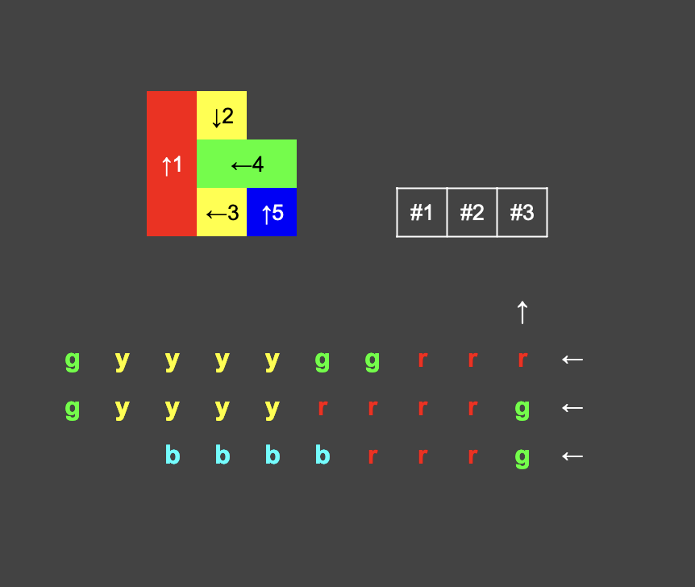

# Rider Rush

This repository is a playground for developing algorithms that generate setup data for level creation in transportation simulation games—a popular genre in mobile gaming.

## Game Setup

Players must navigate vehicles out of a crowded **Parking Lot**, line them up in a **Pickup Area**, and ensure all riders in **Rider Queue** are seated in vehicles of matching colors. The goal is to successfully transport all riders by carefully managing vehicle exits, seating arrangements, and rider flow. On one screen, there are two entity types (Rider, Vehicle) and three main areas (Rider Queue, Pickup Area, Parking Lot).

### Riders

1. All are the same, with the only difference being the colors assigned to them.
2. An array of color names can be used as a constant called COLORS.
3. Each color’s riders must correspond exactly to the seating capacity of vehicles of the same color.
4. The total number of seats across all vehicles must match the total number of riders.

### Vehicles

1. Each vehicle has a specific **color** and can only accommodate riders of that same color.
2. All vehicle types have the same width, of 1 unit in Parking Lot.
3. Vehicle types differ based on their lengths and rider capacities.
4. Vehicles can move only in the direction they face.
5. Vehicles can move to the Pickup Area freely after they leave the Parking Area, in any of the 4 directions.

### Rider Queue

1. Riders wait in a linear queue, with each rider assigned a specific color.
2. The number of riders exactly matches the total available seats across all vehicles in the game setup.
3. Riders can only board a vehicle of the same color and will board only when a matching-color seat is available in the pick-up area.
4. **Boarding Rule**: If there are multiple vehicles of the same color in the pickup area, the first rider of that color will board the vehicle with the fewest available seats, allowing it to leave as soon as it is fully loaded.
5. The rider queue sequence should be arranged to enable efficient boarding, ensuring no rider is indefinitely blocked from boarding due to seat unavailability.

### Pickup Area

1. A staging area with a maximum capacity defined by the constant **SLOTS**, where vehicles wait to be fully seated by matching-color riders.
2. If the Pickup Area is full, vehicles in the Parking Lot must wait until a slot becomes available."
3. Each slot can accommodate only one vehicle at a time, regardless of size.

### Parking Lot

1. Vehicles are positioned randomly in the Parking Lot with varying orientations and may block each other.
2. Movement depends on clear paths and alignment with each vehicle’s facing direction.
3. Vehicles are positioned to minimize empty space between them. The used area should be close to a square shape.
4. The initial parking map should be set up such that every vehicle has the potential to exit, even if initially blocked.
5. Due to the restriction that vehicles can only move in one direction, it's possible for a randomly generated layout to result in a situation where vehicles are unable to exit. Therefore, the output must ensure that there is a clear exit route for all vehicles. For instance, if two cars are parked next to each other and facing each other, they would be completely blocked from moving. The algorithm must avoid such configurations to guarantee that every vehicle has a potential path to exit Parking Lot.

## Objective

Develop algorithm(s) to generate valid game setup data to build the UI. Each setup should initialize the parking lot with vehicles of different colors and capacities, position riders in a queue, and ensure that all riders can be seated in vehicles of matching colors by the end of the game.

Input and output formats are flexible as long as they suit the algorithm and design. Helper algorithms can be useful, for example, in validating the game setup and confirming that the game is solvable at least in one way.

The algorithm should report the initial setup as comprehensive as possible. The first two below are required to generate levels. The rest are better to have for optional features such as detecting the level difficulty and giving hints when the players get stuck.

- **Rider Queue**: The ordered list of riders in the queue, showing their assigned colors.
- **Parking Lot Map**: A layout/map of the initial parkings, indicating the positions, orientations, and colors of each vehicle.
- **Number of Possible Solutions**: A count of the different ways the riders can be seated in vehicles.
- **Steps to Transport All Riders**: A collection of the solution steps required to transport all riders to their respective vehicles, outlining the sequence of actions taken.

## Sample Setup

Using the constants and inputs:

- Colors: [ "red", "yellow", "green", "blue" ]
- Number of slots in Pickup Area: 3
- Vehicle types
  - Car: Holds 4 riders, occupies 1 unit of length.
  - Minibus: Holds 6 riders, occupies 2 units of length.
  - Bus: Holds 10 riders, occupies 3 units of length.
- Initial counts: 5 vehicles, 28 riders
  - 1 red bus: 10 red riders
  - 2 yellow cars: 8 yellow riders
  - 1 green minibus: 6 green riders
  - 1 blue car: 4 blue riders

One possible solution:

- Step 1
  - Vehicle #1 to Slot #1
  - 3 red riders boarding Vehicle #1 (3/10)
- Step 2
  - Vehicle #4 to Slot #2
  - 2 green riders boarding Vehicle #4 (2/6)
- Step 3
  - Vehicle #3 to Slot #3
  - 4 yellow riders boarding Vehicle #3 (4/4)
  - Vehicle #3 departing
  - 2 green riders boarding Vehicle #4 (4/6)
  - 4 red riders boarding Vehicle #1 (7/10)
- Step 4
  - Vehicle #2 to Slot #3
  - 4 yellow riders boarding Vehicle #2 (4/4)
  - Vehicle #2 departing
  - 2 green riders boarding Vehicle #4 (6/6)
  - Vehicle #4 departing
  - 3 red riders boarding Vehicle #1 (10/10)
  - Vehicle #1 departing
- Step 5
  - Vehicle #5 to Slot #1
  - 4 blue riders boarding Vehicle #5 (4/4)
  - Vehicle #5 departing
